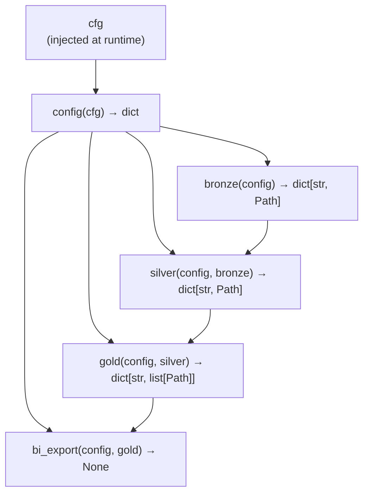
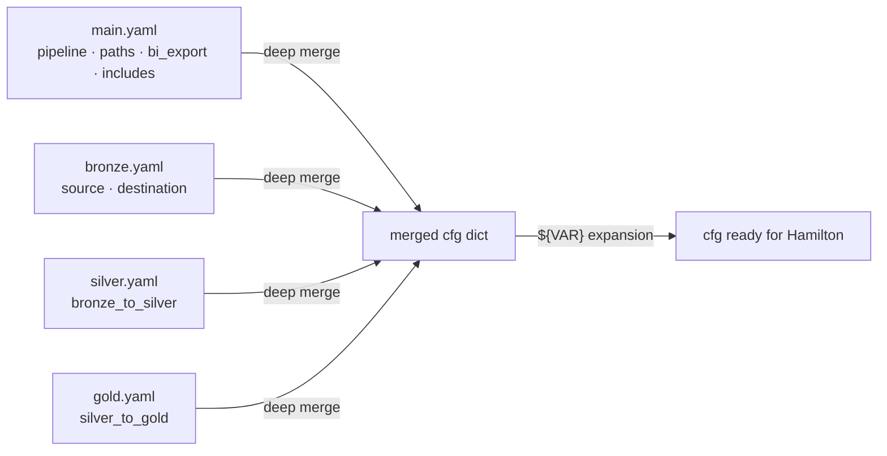
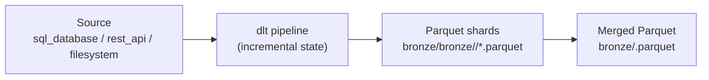
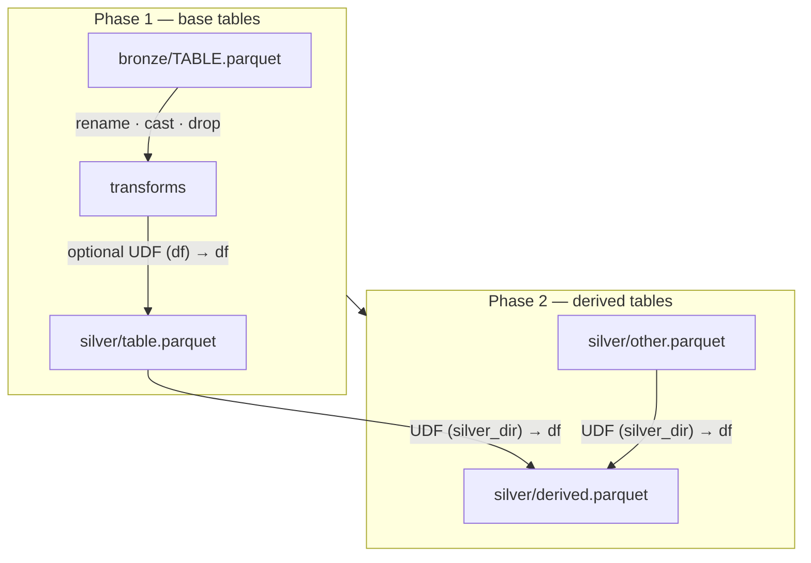
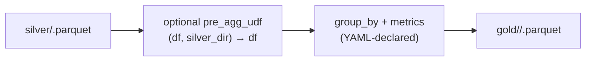

# Architecture

## The Hamilton DAG

OpenMedallion uses [Hamilton](https://hamilton.dagworks.io) to declare the pipeline as a DAG (directed acyclic graph). Each pipeline layer is a Hamilton **node** — a Python function whose argument names encode its dependencies.



Hamilton reads the argument list of each function and builds the execution graph automatically. No explicit wiring code is needed — the names *are* the edges.

---

## Layer Execution

The CLI selects which Hamilton node to execute as the **final variable**. Hamilton then computes only the transitive dependencies required for that node.

| `--layer` | `final_vars` | Nodes executed |
| --- | --- | --- |
| `bronze` | `["bronze"]` | config → bronze |
| `silver` | `["silver"]` | config → bronze → silver |
| `gold` | `["gold"]` | config → bronze → silver → gold |
| `export` | `["bi_export"]` | config → bronze → silver → gold → bi_export |

### Skipping layers with `overrides`

When you run `--layer silver` or `--layer gold`, you do not want to re-run bronze from scratch. OpenMedallion uses Hamilton's **`overrides`** mechanism to inject pre-computed values for upstream nodes.

```python
# cli/main.py — simplified
inputs    = {"cfg": cfg}
overrides = {}

if layer in ("silver", "gold"):
    overrides["bronze"] = _discover_bronze_paths(cfg)  # dict[str, Path]

if layer == "gold":
    overrides["silver"] = _discover_silver_paths(cfg)  # dict[str, Path]

dr.execute(final_vars=final_vars, inputs=inputs, overrides=overrides)
```

!!! important "inputs vs overrides"
    **`inputs`** are for **leaf nodes** — values that have no dependencies in the DAG (e.g. `cfg`).

    **`overrides`** are for **intermediate nodes** — they replace the result of a node that *would* be computed, regardless of its position in the DAG.

    `bronze` depends on `config`, so it is an intermediate node. Passing it in `inputs` is silently ignored by Hamilton. It must be passed in `overrides` to actually skip execution.

---

## Config Loading

Before Hamilton executes, `load_project()` reads the four YAML files and merges them into a single dict:



The merged dict is injected into Hamilton as `cfg` (a leaf-node input). The `config` node passes it through unchanged — this gives Hamilton a typed node to depend on rather than a raw external value.

---

## Bronze Layer

`BronzeLoader` wraps dlt to ingest data from any configured source into Parquet files in `paths.bronze/`.



dlt writes **sharded** Parquet files. `BronzeLoader._collect_parquets()` merges them into a single file per table so silver always reads one clean file.

---

## Silver Layer

`SilverTransformer` runs in two sequential phases:



**Phase 1** — each entry in `bronze_to_silver.tables` is processed independently: structural transforms first, then an optional in-row UDF.

**Phase 2** — each `derived_tables` entry calls a UDF that reads freely from the silver directory and returns a new DataFrame. Derived tables see all base tables written in Phase 1.

---

## Gold Layer

`GoldAggregator` processes each aggregation block:



The `pre_agg_udf` step runs **before** the group_by aggregation. It is the correct place to derive columns (e.g. `order_month` from `order_date`) or join additional tables that should affect the grouping.

---

## Storage Abstraction

All pipeline code calls `openmedallion.storage` functions instead of `pathlib` or `pl.read_parquet` directly. This is what makes pipelines portable between local and S3:

| Call | Local | S3 |
| --- | --- | --- |
| `read_parquet(path)` | `pl.read_parquet(path)` | `pl.read_parquet(path, storage_options=...)` |
| `write_parquet(df, path)` | `df.write_parquet(path)` | `df.write_parquet(path, storage_options=...)` |
| `join(base, *parts)` | `os.path.join(base, *parts)` | `base.rstrip("/") + "/" + ...` |
| `exists(path)` | `Path(path).exists()` | `s3fs.S3FileSystem().exists(path)` |

To switch from local storage to S3, change `paths.*` in `main.yaml` to `s3://your-bucket/...` and set the four `AWS_*` environment variables. No code changes required.
