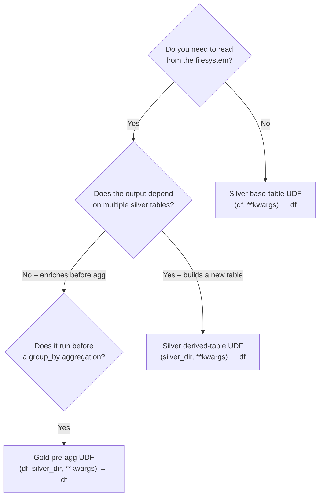

# UDF Guide

OpenMedallion has three distinct UDF types. Each has a different signature, receives different arguments, and is called at a different point in the pipeline.

---

## Overview

| UDF type | Where declared | Called when | Signature |
| --- | --- | --- | --- |
| Silver base-table | `silver.yaml → transforms` | After structural transforms, once per table | `(df, **kwargs) → df` |
| Silver derived-table | `silver.yaml → derived_tables` | After all base tables are written | `(silver_dir, **kwargs) → df` |
| Gold pre-aggregation | `gold.yaml → pre_agg_udf` | Before `group_by`, once per aggregation block | `(df, silver_dir, **kwargs) → df` |

All UDFs must return a `pl.DataFrame`. The framework calls `check_return()` on every result and raises `TypeError` immediately if the return type is wrong.

---

## 1. Silver Base-Table UDF

**Purpose:** Add, filter, or reshape columns on a single bronze-sourced table.

**Signature:**
```python
def my_udf(df: pl.DataFrame, **kwargs) -> pl.DataFrame:
    ...
```

**YAML declaration** (inside a `transforms` list):
```yaml
bronze_to_silver:
  tables:
    - source_file: ORDERS.parquet
      output_file: orders.parquet
      transforms:
        - type: rename
          columns: {ORDER_ID: order_id}
        - type: cast
          columns: {order_id: Int64}
        - type: udf
          file: projects/my_project/udf/silver/base.py
          function: flag_large_orders
          args:
            threshold: 500.0
```

**Key points:**

- Runs after all structural transforms (`rename`, `cast`, `drop`) in the same `transforms` list
- Receives the already-renamed and cast DataFrame as `df`
- `args:` from the YAML are passed as keyword arguments
- Must not read from the filesystem — only operate on `df`

**Example:**
```python
# projects/my_project/udf/silver/base.py
import polars as pl

def flag_large_orders(df: pl.DataFrame, threshold: float = 100.0) -> pl.DataFrame:
    return df.with_columns(
        (pl.col("amount") >= threshold).alias("is_large_order")
    )
```

---

## 2. Silver Derived-Table UDF

**Purpose:** Build a new silver table by joining or aggregating existing silver tables. Called after *all* base tables have been written to `silver_dir`.

**Signature:**
```python
def my_udf(silver_dir: str | Path, **kwargs) -> pl.DataFrame:
    ...
```

**YAML declaration** (inside `derived_tables`):
```yaml
bronze_to_silver:
  tables: [...]           # base tables written first
  derived_tables:
    - output_file: order_lines_enriched.parquet
      udf:
        file: projects/my_project/udf/silver/enrich.py
        function: build_order_lines_enriched
```

**Key points:**

- `silver_dir` is the directory where base tables were written — use `storage.read_parquet` and `storage.join` to read from it
- Do **not** use `pl.read_parquet(path)` or `Path(silver_dir) / "file.parquet"` — use `openmedallion.storage` so the UDF works with both local paths and `s3://` URIs
- The returned DataFrame is written to `silver_dir/<output_file>`

**Example:**
```python
# projects/my_project/udf/silver/enrich.py
import polars as pl
from openmedallion.storage import read_parquet, join

def build_order_lines_enriched(silver_dir) -> pl.DataFrame:
    orders   = read_parquet(join(silver_dir, "orders.parquet"))
    products = read_parquet(join(silver_dir, "products.parquet"))

    return (
        orders
        .join(products, on="product_id", how="left")
        .with_columns(
            (pl.col("qty").cast(pl.Float64) * pl.col("unit_price")).alias("line_revenue")
        )
    )
```

!!! tip "Use the helper library"
    `openmedallion.helpers.joins` has `lookup_join`, `safe_join`, `multi_join` and more — use them in derived UDFs instead of raw `.join()` calls for null-safe, composable joins.

---

## 3. Gold Pre-Aggregation UDF

**Purpose:** Enrich or transform the source DataFrame before the `group_by` aggregation runs. The primary use cases are:

- Deriving columns needed as group keys (e.g. extracting `order_month` from `order_date`)
- Joining additional silver tables for extra dimensions
- Filtering rows before aggregation

**Signature:**
```python
def my_udf(df: pl.DataFrame, silver_dir: str | Path, **kwargs) -> pl.DataFrame:
    ...
```

**YAML declaration** (inside an `aggregations` block):
```yaml
silver_to_gold:
  projects:
    - name: analytics
      aggregations:
        - source_file: order_lines_enriched.parquet
          pre_agg_udf:
            file: projects/my_project/udf/gold/metrics.py
            function: add_metrics
            args:
              include_region: true
          group_by: [order_month, category]
          metrics:
            - {column: line_revenue, agg: sum, alias: monthly_revenue}
          output_file: revenue_by_month_category.parquet
```

**Key points:**

- Receives the full source DataFrame plus `silver_dir` (in case it needs to join additional tables)
- Runs **before** the `group_by` aggregation — any column added here can be used as a group key or metric
- If the UDF adds a column used in `group_by`, it must do so before returning
- `args:` from YAML are passed as keyword arguments

**Example:**
```python
# projects/my_project/udf/gold/metrics.py
import polars as pl
from openmedallion.storage import read_parquet, join, exists

def add_metrics(df: pl.DataFrame, silver_dir, include_region: bool = False) -> pl.DataFrame:
    # Derive temporal group key
    df = df.with_columns(
        pl.col("order_date").str.slice(0, 7).alias("order_month")
    )

    # Optionally join region data
    if include_region:
        region_path = join(silver_dir, "regions.parquet")
        if exists(region_path):
            regions = read_parquet(region_path)
            df = df.join(regions.select(["customer_id", "region"]),
                         on="customer_id", how="left")

    return df
```

---

## Choosing the Right UDF Type



---

## UDF Loading and Caching

All UDFs are loaded dynamically at runtime via `load_udf()`. The file is imported once per pipeline run and cached by resolved path — repeated calls for the same file do not re-import the module.

```python
from openmedallion.contracts.udf import load_udf, check_return

fn, kwargs = load_udf(step, cache=self._udf_cache, layer="silver")
result = fn(df, **kwargs)
check_return(result, step["function"], step["file"], layer="silver")
```

If the UDF file does not exist, `FileNotFoundError` is raised with the path and a hint that it is relative to the project root. If the function name is not found in the module, `AttributeError` lists the available names in the file.

---

## Common Mistakes

!!! warning "Using `pl.read_parquet` directly in a derived UDF"
    ```python
    # WRONG — breaks on S3 paths
    df = pl.read_parquet(Path(silver_dir) / "orders.parquet")

    # CORRECT — works locally and on S3
    from openmedallion.storage import read_parquet, join
    df = read_parquet(join(silver_dir, "orders.parquet"))
    ```

!!! warning "Returning something other than a DataFrame"
    ```python
    # WRONG — raises TypeError immediately
    def my_udf(df, **kwargs):
        return df.to_pandas()   # pd.DataFrame, not pl.DataFrame

    # CORRECT
    def my_udf(df, **kwargs):
        return df.with_columns(...)
    ```

!!! warning "Putting group keys in a base-table UDF"
    If you need `order_month` as a `group_by` key in gold, add it in the **gold pre-agg UDF**, not in the silver base-table UDF. Adding it in silver works but couples silver schema to gold's aggregation needs.
