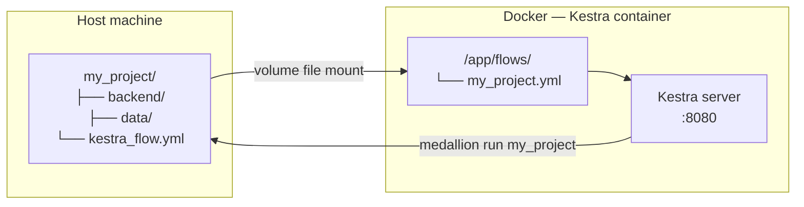
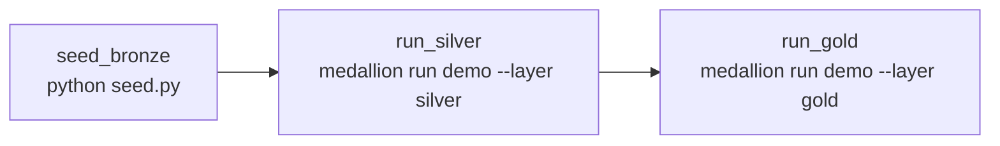
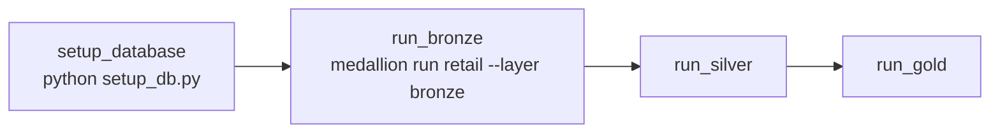
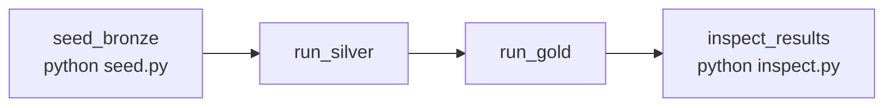

# Scheduling with Kestra

Every project scaffolded with `medallion init` includes a `kestra_flow.yml` file — a ready-to-run [Kestra](https://kestra.io) flow that orchestrates the full Bronze → Silver → Gold pipeline with per-task observability, automatic retry, and optional cron scheduling.

---

## Why Kestra?

Hamilton is a DAG execution library, not an orchestrator — it has no built-in scheduler. For recurring pipeline runs you need an external tool to call `medallion run` on a schedule.

Kestra is the recommended choice for local and on-prem deployments because it runs where your data lives, provides per-task visibility, and supports backfill out of the box.

| | Kestra | GitHub Actions |
| --- | --- | --- |
| Best for | Recurring pipeline runs, local / on-prem data | CI tests + PyPI publish on tag push |
| Scheduling | Cron + backfill | Cron only, no backfill |
| Observability | Per-task logs, run history, retry from failed task | Flat job log |
| Data access | Runs on-prem — local files and DBs are reachable | Runs on GitHub runners — can't reach local data |
| Infrastructure | Self-hosted Docker | GitHub-managed runners |

**Recommended split:** GitHub Actions for CI + publish; Kestra for pipeline scheduling.

---

## Architecture



The project folder is mounted into the Kestra container. `kestra_flow.yml` is mapped directly into Kestra's watched `flows/` directory — no copying or manual registration needed.

---

## Setup

### Prerequisites

- [Docker Desktop](https://www.docker.com/products/docker-desktop/) running
- `openmedallion` repo cloned locally

### 1. Start the Kestra server

```bash
# from the openmedallion repo root
make kestra-up
```

This starts:

- **PostgreSQL 15** — Kestra's internal state store
- **Kestra** (standalone mode) — UI at `http://localhost:8080`, API at `http://localhost:8081`

The three example project flows are pre-registered via Docker volume file mounts in `docker-compose.yml`.

### 2. Open the UI

Navigate to `http://localhost:8080`. You should see three namespaced flows:

| Namespace | Flow ID | Trigger |
| --- | --- | --- |
| `openmedallion.examples` | `demo` | Manual |
| `openmedallion.examples` | `retail` | Daily at 06:00 UTC |
| `openmedallion.examples` | `ecommerce` | Manual |

### 3. Run a flow manually

Click any flow → **Execute** → **Save & Execute**. Each task appears as a coloured node. Click a task to stream its logs in real time.

### 4. Stop the server

```bash
make kestra-down
```

---

## Registering your own project

When you scaffold a new project with `medallion init my_project`, a `my_project/kestra_flow.yml` is generated automatically. To register it with Kestra, add one line to the `volumes` section of the `kestra` service in `docker-compose.yml`:

```yaml
services:
  kestra:
    volumes:
      # existing example mounts
      - ./examples/local_parquet_demo/demo/kestra_flow.yml:/app/flows/demo.yml
      - ./examples/incremental_sql_demo/retail/kestra_flow.yml:/app/flows/retail.yml
      - ./examples/ecommerce_analytics_demo/ecommerce/kestra_flow.yml:/app/flows/ecommerce.yml
      # add your project
      - ./my_project/kestra_flow.yml:/app/flows/my_project.yml
```

Restart Kestra and it picks up the flow immediately:

```bash
make kestra-down && make kestra-up
```

---

## The generated `kestra_flow.yml`

`medallion init` writes the following template (substituting your project name):

```yaml
id: my_project
namespace: openmedallion.projects
description: "Bronze → Silver → Gold pipeline for my_project."

tasks:
  - id: run_bronze
    type: io.kestra.plugin.scripts.python.Commands
    warningOnStdErr: false
    commands:
      - pip install openmedallion --quiet
      - medallion run my_project --layer bronze
    workingDirectory: /app/my_project

  - id: run_silver
    type: io.kestra.plugin.scripts.python.Commands
    warningOnStdErr: false
    dependsOn: [run_bronze]
    commands:
      - medallion run my_project --layer silver
    workingDirectory: /app/my_project

  - id: run_gold
    type: io.kestra.plugin.scripts.python.Commands
    warningOnStdErr: false
    dependsOn: [run_silver]
    commands:
      - medallion run my_project --layer gold
    workingDirectory: /app/my_project

# Uncomment to enable scheduled runs:
# triggers:
#   - id: daily_refresh
#     type: io.kestra.plugin.core.trigger.Schedule
#     cron: "0 6 * * *"   # every day at 06:00 UTC
```

Key design decisions:

- **Task type** — `io.kestra.plugin.scripts.python.Commands` calls the `medallion` CLI directly; no Python SDK required inside Kestra.
- **`workingDirectory`** — set to the project folder mounted inside the container so relative paths in `main.yaml` resolve correctly.
- **`pip install openmedallion --quiet`** — the first bronze task ensures the CLI is available in the Kestra Python environment on each run.
- **`dependsOn`** — enforces bronze → silver → gold sequencing; Kestra will not start a task until its upstream tasks succeed.
- **`warningOnStdErr: false`** — suppresses pip output from being flagged as warnings.

---

## Enabling scheduled runs

Uncomment and edit the `triggers:` block in `kestra_flow.yml`:

```yaml
triggers:
  - id: daily_refresh
    type: io.kestra.plugin.core.trigger.Schedule
    cron: "0 6 * * *"   # every day at 06:00 UTC
```

Common cron patterns:

| Schedule | Cron expression |
| --- | --- |
| Every day at 06:00 UTC | `0 6 * * *` |
| Every hour | `0 * * * *` |
| Every Monday at 08:00 UTC | `0 8 * * 1` |
| Every 15 minutes | `*/15 * * * *` |

After editing, restart Kestra (`make kestra-down && make kestra-up`) — the updated schedule takes effect immediately.

---

## Triggering via API

Useful for integrating Kestra into CI or external scripts:

```bash
# trigger a one-off execution
curl -X POST \
  http://localhost:8080/api/v1/executions/openmedallion.projects/my_project

# trigger with labels
curl -X POST \
  "http://localhost:8080/api/v1/executions/openmedallion.projects/my_project" \
  -H "Content-Type: application/json" \
  -d '{"labels": {"env": "prod"}}'

# list recent executions
curl http://localhost:8080/api/v1/executions/search \
  -G -d "namespace=openmedallion.projects" -d "flowId=my_project"
```

---

## Example flows

### local\_parquet\_demo



Runs manually. Seeds bronze from the bundled CSV, then transforms through silver and gold.

### incremental\_sql\_demo



Scheduled daily at 06:00 UTC. On each run, the bronze task picks up only new or changed rows — dlt cursor state persists between runs in the mounted data directory.

### ecommerce\_analytics\_demo



Runs manually. Includes an `inspect_results` task that prints gold output to the Kestra task log.

---

## Makefile targets

| Target | Command | What it does |
| --- | --- | --- |
| `make kestra-up` | `docker compose up -d` | Start Postgres + Kestra in the background |
| `make kestra-down` | `docker compose down` | Stop and remove containers |
| `make kestra-logs` | `docker compose logs -f kestra` | Stream live Kestra logs |

---

## Troubleshooting

**Flow not appearing in the UI after adding volume mount**
: Verify the host path in `docker-compose.yml` is correct and the file exists. Restart with `make kestra-down && make kestra-up`. Kestra only scans the `flows/` directory on startup.

**`medallion: command not found` inside a task**
: The `pip install openmedallion --quiet` command in the first task installs the CLI. If you are running a layer-only flow (no bronze step), add the install command to whichever task runs first.

**`workingDirectory` paths not resolving**
: The `workingDirectory` must match the container-side path of your mounted project folder. Check the `volumes` section in `docker-compose.yml` and ensure the path after `:` matches what you set in `workingDirectory`.

**Port 8080 already in use**
: Change the host port in `docker-compose.yml` (`"8090:8080"` for example) and access the UI at the new port.
