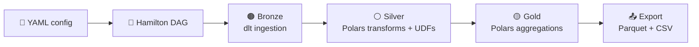

# OpenMedallion

**Declarative medallion pipelines in pure open-source Python — local first, cloud portable, fast by default.**

OpenMedallion is an opinionated library for building **Bronze → Silver → Gold** data pipelines using [dlt](https://dlthub.com), [Polars](https://pola.rs), and [Hamilton](https://hamilton.dagworks.io).

---

## Navigation

| Section | What you'll find |
| --- | --- |
| **Concepts** | How the Hamilton DAG is structured, how layer execution works, UDF contract guide |
| **Reference** | Every YAML config key documented, all CLI flags |
| **API** | Every public function and class with signatures, parameters, and examples |

---

## Quick Start

```bash
pip install openmedallion

medallion init my_project
medallion run  my_project
```

---

## Architecture at a Glance



| Layer | Engine | Role |
| --- | --- | --- |
| Bronze | dlt | Schema-inferred ingestion from SQL, REST, or filesystem |
| Silver | Polars | Rename, cast, filter, and UDF-based enrichment |
| Gold | Polars | YAML-declared `group_by` aggregations |
| Export | Polars | Copy gold Parquet + write CSV for BI tools |
| Orchestration | Hamilton | DAG wiring, layer-level execution, live tracker |

---

## Examples

| Example | Shows |
| --- | --- |
| [`local_parquet_demo`](https://github.com/your-org/openmedallion/tree/main/examples/local_parquet_demo) | Zero-credential CSV → silver → gold quickstart |
| [`incremental_sql_demo`](https://github.com/your-org/openmedallion/tree/main/examples/incremental_sql_demo) | Append + merge incremental loads via SQLite |
| [`ecommerce_analytics_demo`](https://github.com/your-org/openmedallion/tree/main/examples/ecommerce_analytics_demo) | Multi-table joins, derived silver, gold pre-agg UDFs |
