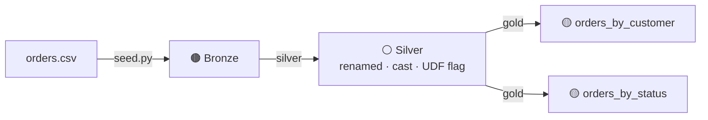
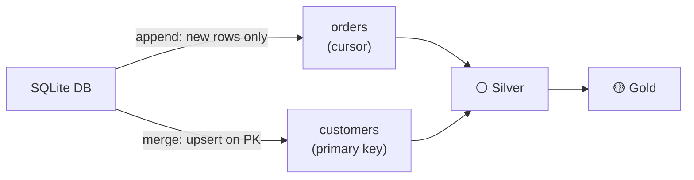
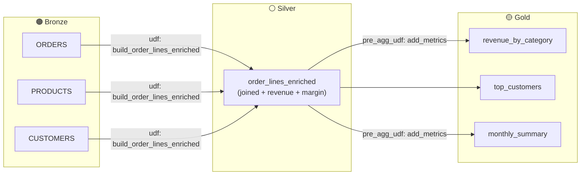

# 📚 Examples

Three self-contained examples, each runnable with `pip install openmedallion` and no cloud credentials.

---

## 1. 📂 [local_parquet_demo](local_parquet_demo/)

**Best for:** first-time users who want to see the full silver → gold flow in under 5 minutes.



| What it shows | Details |
| --- | --- |
| Silver transforms | `rename`, `cast`, inline Python UDF |
| Gold aggregations | Two `group_by` specs in YAML |
| No credentials | CSV file bundled in the repo |

```bash
cd examples/local_parquet_demo
python seed.py
medallion run demo --layer silver
medallion run demo --layer gold
```

---

## 2. 🔄 [incremental_sql_demo](incremental_sql_demo/)

**Best for:** anyone who needs to handle growing datasets — only load what changed.



| What it shows | Details |
| --- | --- |
| Append mode | `cursor_column: created_at` — only newer rows loaded |
| Merge mode | `primary_key: customer_id` — full upsert |
| Delta simulation | `add_delta.py` adds rows + updates a customer tier |

```bash
cd examples/incremental_sql_demo
python setup_db.py
medallion run retail --layer bronze
medallion run retail
python add_delta.py          # simulate new data
medallion run retail --layer bronze   # only 2 new rows picked up
medallion run retail
```

---

## 3. 🛒 [ecommerce_analytics_demo](ecommerce_analytics_demo/)

**Best for:** building a real analytics use case — multi-table joins, margin analysis, trends.



| What it shows | Details |
| --- | --- |
| Silver derived tables | UDF joins 3 tables into one enriched Parquet |
| Gold pre-aggregation UDF | Derives `order_month` before `group_by` |
| Margin analysis | `line_revenue`, `line_cost`, `margin_amount` computed in UDF |
| Temporal trends | Month-over-month revenue via `order_month` grouping |

```bash
cd examples/ecommerce_analytics_demo
python seed.py
medallion run ecommerce --layer silver
medallion run ecommerce --layer gold
python inspect.py            # prints all 3 gold tables with totals
```

---

## Progression

| Example | Tables | Bronze | Silver UDF | Gold UDF | Incremental |
| --- | --- | --- | --- | --- | --- |
| local_parquet_demo | 1 | pre-seeded | inline flag | — | — |
| incremental_sql_demo | 2 | dlt + SQLite | cast only | — | append + merge |
| ecommerce_analytics_demo | 3 | pre-seeded | derived join | pre_agg_udf | — |
