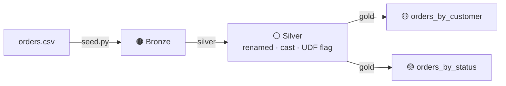
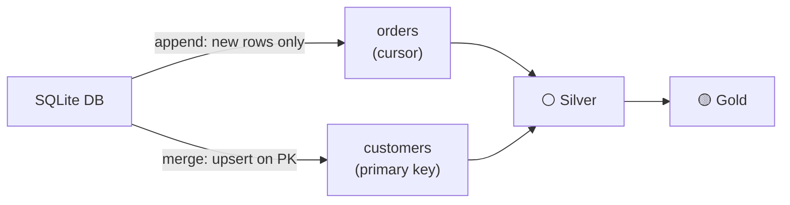
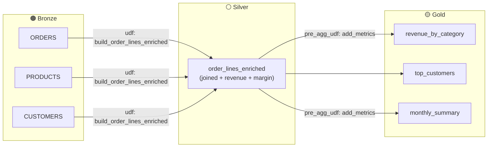
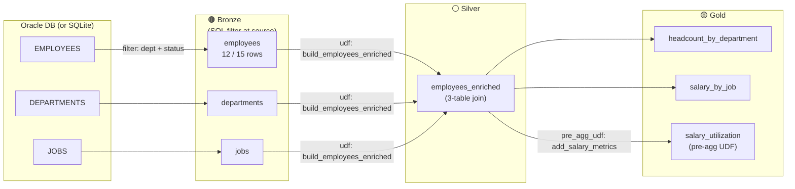
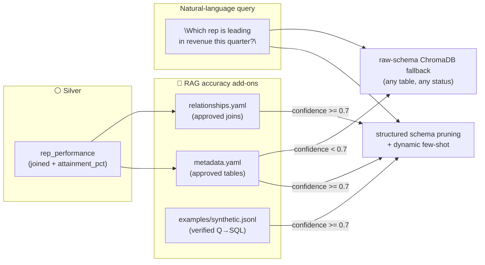

# 📚 Examples

Five self-contained examples, each runnable with `pip install openmedallion` and no cloud credentials.

---

## 1. 📂 [local_parquet_demo](local_parquet_demo/)

**Best for:** first-time users who want to see the full silver → gold flow in under 5 minutes.


```mermaid
flowchart LR
    CSV["orders.csv"] -->|seed.py| B["🟤 Bronze"]
    B -->|silver| S["⚪ Silver\nrenamed · cast · UDF flag"]
    S -->|gold| G1["🟡 orders_by_customer"]
    S -->|gold| G2["🟡 orders_by_status"]
```

| What it shows | Details |
| --- | --- |
| Silver transforms | `rename`, `cast`, inline Python UDF |
| Gold aggregations | Two `group_by` specs in YAML |
| No credentials | CSV file bundled in the repo |

```bash
cd examples/local_parquet_demo
python seed.py
medallion run demo --layer silver
medallion run demo --layer gold
```

---

## 2. 🔄 [incremental_sql_demo](incremental_sql_demo/)

**Best for:** anyone who needs to handle growing datasets — only load what changed.


```mermaid
flowchart LR
    DB["SQLite DB"] -->|"append: new rows only"| O["orders\n(cursor)"]
    DB -->|"merge: upsert on PK"| C["customers\n(primary key)"]
    O & C --> S["⚪ Silver"] --> G["🟡 Gold"]
```

| What it shows | Details |
| --- | --- |
| Append mode | `cursor_column: created_at` — only newer rows loaded |
| Merge mode | `primary_key: customer_id` — full upsert |
| Delta simulation | `add_delta.py` adds rows + updates a customer tier |

```bash
cd examples/incremental_sql_demo
python setup_db.py
medallion run retail --layer bronze
medallion run retail
python add_delta.py          # simulate new data
medallion run retail --layer bronze   # only 2 new rows picked up
medallion run retail
```

---

## 3. 🛒 [ecommerce_analytics_demo](ecommerce_analytics_demo/)

**Best for:** building a real analytics use case — multi-table joins, margin analysis, trends.


```mermaid
flowchart LR
    subgraph bronze["🟤 Bronze"]
        BO["ORDERS"] & BP["PRODUCTS"] & BC["CUSTOMERS"]
    end
    subgraph silver["⚪ Silver"]
        EN["order_lines_enriched\n(joined + revenue + margin)"]
    end
    subgraph gold["🟡 Gold"]
        G1["revenue_by_category"]
        G2["top_customers"]
        G3["monthly_summary"]
    end

    BO & BP & BC -->|"udf: build_order_lines_enriched"| EN
    EN -->|"pre_agg_udf: add_metrics"| G1
    EN --> G2
    EN -->|"pre_agg_udf: add_metrics"| G3
```

| What it shows | Details |
| --- | --- |
| Silver derived tables | UDF joins 3 tables into one enriched Parquet |
| Gold pre-aggregation UDF | Derives `order_month` before `group_by` |
| Margin analysis | `line_revenue`, `line_cost`, `margin_amount` computed in UDF |
| Temporal trends | Month-over-month revenue via `order_month` grouping |

```bash
cd examples/ecommerce_analytics_demo
python seed.py
medallion run ecommerce --layer silver
medallion run ecommerce --layer gold
python inspect.py            # prints all 3 gold tables with totals
```

---

---

## 4. 🏢 [oracle_hr_demo](oracle_hr_demo/)

**Best for:** anyone connecting to a relational database (Oracle, Postgres, MySQL) who needs to filter rows at the source before they enter the lake.


```mermaid
flowchart LR
    subgraph oracle["Oracle DB (or SQLite)"]
        E["EMPLOYEES"] & D["DEPARTMENTS"] & J["JOBS"]
    end
    subgraph bronze["🟤 Bronze\n(SQL filter at source)"]
        BE["employees\n12 / 15 rows"]
        BD["departments"]
        BJ["jobs"]
    end
    subgraph silver["⚪ Silver"]
        EN["employees_enriched\n(3-table join)"]
    end
    subgraph gold["🟡 Gold"]
        G1["headcount_by_department"]
        G2["salary_by_job"]
        G3["salary_utilization\n(pre-agg UDF)"]
    end

    E -->|"filter: dept + status"| BE
    D --> BD
    J --> BJ
    BE & BD & BJ -->|"udf: build_employees_enriched"| EN
    EN --> G1 & G2
    EN -->|"pre_agg_udf: add_salary_metrics"| G3
```

| What it shows | Details |
| --- | --- |
| Bronze SQL filter | `filter:` field pushes `WHERE` clause to dlt — rows excluded at source |
| Incremental append | `employees` loaded with `cursor_column: hire_date` |
| Incremental merge | `departments` and `jobs` upserted on primary key |
| Silver derived table | UDF joins 3 tables into one enriched Parquet |
| Gold pre-agg UDF | Computes `salary_pct_of_max` before `group_by` |
| Real Oracle swap | Set `ORACLE_CONN_STR` env var — no code changes |

```bash
cd examples/oracle_hr_demo
python setup_db.py
medallion run oracle_hr --projects . --layer bronze
medallion run oracle_hr --projects . --layer silver
medallion run oracle_hr --projects .
```

---

## 5. 🧠 [sales_intelligence_demo](sales_intelligence_demo/)

**Best for:** anyone building the natural-language query layer — cerebrum/neuron/cortex,
and the RAG accuracy add-ons (curated metadata, relationships, examples, and the
confidence-gated schema-pruning fallback).


```mermaid
flowchart LR
    subgraph silver["⚪ Silver"]
        RP["rep_performance\n(joined + attainment_pct)"]
    end
    subgraph rag["🧠 RAG accuracy add-ons"]
        MD["metadata.yaml\n(approved tables)"]
        REL["relationships.yaml\n(approved joins)"]
        EX["examples/synthetic.jsonl\n(verified Q→SQL)"]
    end
    subgraph query["Natural-language query"]
        Q["\"Which rep is leading\nin revenue this quarter?\""]
    end

    RP --> MD & REL
    MD & REL & EX -->|"confidence >= 0.7"| SQL1["structured schema pruning\n+ dynamic few-shot"]
    MD -->|"confidence < 0.7"| SQL2["raw-schema ChromaDB fallback\n(any table, any status)"]
    Q --> SQL1 & SQL2
```

| What it shows | Details |
| --- | --- |
| `cerebrum` end-to-end | `show_cerebrum.py` — schema context, prompt, DuckDB execution, recommender |
| Curated metadata + relationships | `metadata.yaml` / `relationships.yaml` — 4 approved tables, 3 approved joins |
| Dynamic few-shot retrieval | `examples/synthetic.jsonl` — verified Q→SQL pairs ranked per question |
| Confidence-gated fallback | `show_rag_workflow.py` — one question clears the 0.7 gate, one triggers the raw-schema fallback |
| `neuron` + `cortex` | `medallion ask` / `medallion cortex` — HTTP server + chat UI |

```bash
cd examples/sales_intelligence_demo
python seed.py
medallion run sales_intel
python show_cerebrum.py         # cerebrum, no Ollama needed
python show_rag_workflow.py     # RAG accuracy add-ons, no Ollama/ChromaDB needed
```

---

## Progression

| Example | Tables | Bronze | Silver UDF | Gold UDF | Incremental |
| --- | --- | --- | --- | --- | --- |
| local_parquet_demo | 1 | pre-seeded | inline flag | — | — |
| incremental_sql_demo | 2 | dlt + SQLite | cast only | — | append + merge |
| ecommerce_analytics_demo | 3 | pre-seeded | derived join | pre_agg_udf | — |
| oracle_hr_demo | 3 | dlt + SQL filter | derived join | pre_agg_udf | append + merge |
| sales_intelligence_demo | 3 | pre-seeded | derived join | pass-through | — (cerebrum + RAG add-ons) |
