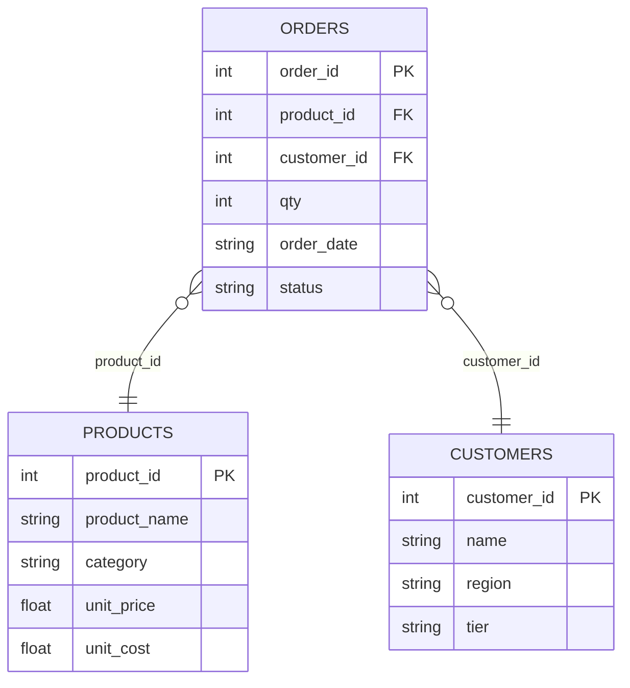
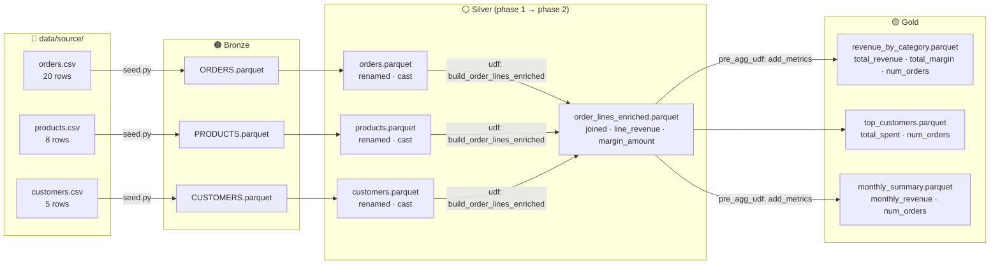

# ecommerce_analytics_demo — `ecommerce`

**Multi-table enrichment, margin analysis, and temporal trends — no credentials required.**

This example shows the most complete OpenMedallion workflow:

- **3 bronze tables** — orders, products, customers
- **Silver phase 1** — rename + cast each table individually
- **Silver phase 2** — a derived UDF joins all three into one enriched table
- **Gold** — 3 aggregations, two of which use a `pre_agg_udf` to derive columns before grouping

---

## Data Model



---

## Pipeline Flow



---

## Source Data

**products.csv** — 8 products across 3 categories:

| product_id | product_name | category | unit_price | unit_cost |
| --- | --- | --- | --- | --- |
| 1 | Laptop Pro 15 | Electronics | 1200.00 | 900.00 |
| 2 | Wireless Headphones | Electronics | 150.00 | 80.00 |
| 3 | Webcam HD | Electronics | 80.00 | 40.00 |
| 4 | Winter Jacket | Clothing | 120.00 | 60.00 |
| 5 | Cotton T-Shirt | Clothing | 30.00 | 12.00 |
| 6 | Running Sneakers | Clothing | 90.00 | 45.00 |
| 7 | Python Mastery | Books | 45.00 | 20.00 |
| 8 | Data Science Handbook | Books | 55.00 | 25.00 |

**customers.csv** — 5 customers across regions and tiers:

| customer_id | name | region | tier |
| --- | --- | --- | --- |
| 1 | Alice Chen | US-West | gold |
| 2 | Bob Smith | US-East | silver |
| 3 | Carol Lee | Europe | gold |
| 4 | David Kim | US-West | bronze |
| 5 | Eve Brown | Asia | silver |

**orders.csv** — 20 orders across Jan–Apr 2024.

---

## How the UDFs Work

### Silver derived UDF — `build_order_lines_enriched`

After the 3 base tables are written to silver, a derived UDF joins them:

```python
# backend/udf/silver/enrich.py
def build_order_lines_enriched(silver_dir):
    orders    = read_parquet(join(silver_dir, "orders.parquet"))
    products  = read_parquet(join(silver_dir, "products.parquet"))
    customers = read_parquet(join(silver_dir, "customers.parquet"))

    return (
        orders
        .join(products,  on="product_id",  how="left")
        .join(customers, on="customer_id", how="left")
        .with_columns([
            (pl.col("qty") * pl.col("unit_price")).alias("line_revenue"),
            (pl.col("qty") * pl.col("unit_cost")).alias("line_cost"),
        ])
        .with_columns(
            (pl.col("line_revenue") - pl.col("line_cost")).alias("margin_amount")
        )
    )
```

### Gold pre-aggregation UDF — `add_metrics`

Derives `order_month` (YYYY-MM) from `order_date` so the YAML can group by month:

```python
# backend/udf/gold/metrics.py
def add_metrics(df, silver_dir):
    return df.with_columns(
        pl.col("order_date").str.slice(0, 7).alias("order_month")
    )
```

---

## Run the Demo

```bash
# From examples/ecommerce_analytics_demo/

python seed.py                           # seed bronze from CSVs
medallion run ecommerce --layer silver   # rename/cast 3 tables + derive enriched join
medallion run ecommerce --layer gold     # 3 aggregations
python inspect.py                        # print gold results
```

Or open `ipynb/walkthrough.ipynb` in Jupyter for a guided step-by-step run.

---

## Expected Output

### `revenue_by_category.parquet`

| category | total_revenue | total_margin | num_orders | margin_pct |
| --- | --- | --- | --- | --- |
| Electronics | 4440.0 | 1300.0 | 8 | 29.3% |
| Clothing | 1080.0 | 576.0 | 8 | 53.3% |
| Books | 345.0 | 190.0 | 4 | 55.1% |

### `top_customers.parquet`

| name | region | tier | total_spent | num_orders |
| --- | --- | --- | --- | --- |
| Alice Chen | US-West | gold | 2970.0 | 5 |
| Carol Lee | Europe | gold | 1790.0 | 5 |
| Eve Brown | Asia | silver | 430.0 | 3 |
| Bob Smith | US-East | silver | 380.0 | 4 |
| David Kim | US-West | bronze | 295.0 | 3 |

### `monthly_summary.parquet`

| order_month | monthly_revenue | num_orders |
| --- | --- | --- |
| 2024-01 | 1755.0 | 4 |
| 2024-02 | 1710.0 | 5 |
| 2024-03 | 1905.0 | 6 |
| 2024-04 | 495.0 | 5 |

---

## Folder Structure

```text
ecommerce/                             ← project root
├── main.yaml                          ← pipeline name, layer includes, data paths
├── README.md                          ← this file
├── kestra_flow.yaml                   ← Kestra orchestration
├── ipynb/
│   └── walkthrough.ipynb              ← guided end-to-end run
├── backend/
│   ├── bronze.yaml                    ← placeholder (seed.py handles bronze)
│   ├── silver.yaml                    ← 3 base tables + 1 derived join
│   ├── gold.yaml                      ← 3 aggregations (2 with pre_agg_udf)
│   └── udf/
│       ├── silver/enrich.py           ← build_order_lines_enriched()
│       └── gold/metrics.py            ← add_metrics() — derives order_month
└── frontend/
    ├── tableau/                       ← Tableau workbook files
    └── powerbi/                       ← Power BI files

data/                                  ← pipeline outputs (gitignored)
├── source/{orders,products,customers}.csv
├── bronze/{ORDERS,PRODUCTS,CUSTOMERS}.parquet
├── silver/{orders,products,customers,order_lines_enriched}.parquet
└── gold/ecommerce/{revenue_by_category,top_customers,monthly_summary}.parquet
```

---

## Things to Try

- Add a `margin_pct` column to `add_metrics()` and aggregate it with `agg: mean` in `backend/gold.yaml`
- Add a `filter` transform in `backend/silver.yaml` to exclude `status = 'cancelled'` orders
- Add a new gold aggregation: revenue by `region` grouped from `top_customers`
