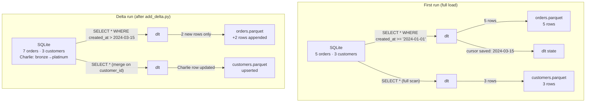

# 🔄 incremental_sql_demo

**Append and merge incremental loads from a local SQLite database — no credentials required.**

This example shows how OpenMedallion handles growing datasets. Run the pipeline twice: the second run loads **only the new and changed rows**, not the full table.

---

## 🔄 Incremental Modes



| Table | Mode | Key | Behaviour |
| --- | --- | --- | --- |
| `orders` | `append` | `cursor_column: created_at` | Only rows newer than the last run are loaded |
| `customers` | `merge` | `primary_key: customer_id` | Full upsert — updates overwrite, new rows insert |

---

## 📊 What the Data Looks Like

**Initial seed (`setup_db.py`):**

| order_id | customer_id | amount | created_at |
| --- | --- | --- | --- |
| 1 | 101 | 150.00 | 2024-01-05 |
| 2 | 102 | 45.50 | 2024-01-06 |
| 3 | 101 | 300.00 | 2024-01-07 |
| 4 | 103 | 80.00 | 2024-01-08 |
| 5 | 102 | 200.00 | 2024-01-09 |

**After delta (`add_delta.py`):**

| Δ | order_id | customer_id | amount | created_at |
| --- | --- | --- | --- | --- |
| ➕ new | 6 | 101 | 90.00 | 2024-02-01 |
| ➕ new | 7 | 103 | 450.00 | 2024-02-02 |

| Δ | customer_id | name | tier |
| --- | --- | --- | --- |
| ✏️ updated | 103 | Charlie | bronze → **platinum** |

On the second bronze run:

- `orders`: dlt reads cursor `2024-01-09` and fetches only the 2 new rows
- `customers`: dlt merges on `customer_id` — Charlie's tier is updated, others unchanged

---

## 🚀 Run the Demo

```bash
# From this directory (examples/incremental_sql_demo/)

# Step 1 — create SQLite database with seed data
python setup_db.py

# Step 2 — full bronze load (5 orders, 3 customers)
medallion run retail --layer bronze

# Step 3 — silver + gold
medallion run retail

# Inspect first-run gold output
python -c "
import polars as pl
print(pl.read_parquet('retail/data/gold/retail/customer_summary.parquet').sort('customer_id'))
print(pl.read_parquet('retail/data/gold/retail/pipeline_totals.parquet'))
"
```

---

## 🔁 Delta Load — Observe Incremental Behaviour

```bash
# Add 2 new orders + update Charlie's tier
python add_delta.py

# Bronze: only picks up 2 new orders + merges Charlie's customer row
medallion run retail --layer bronze

# Re-run silver + gold
medallion run retail

# Verify: Charlie now shows 2 orders; totals reflect the 2 new rows
python -c "
import polars as pl
print(pl.read_parquet('retail/data/gold/retail/customer_summary.parquet').sort('customer_id'))
print(pl.read_parquet('retail/data/gold/retail/pipeline_totals.parquet'))
"
```

---

## 📊 Expected Output After Full Pipeline

### `customer_summary.parquet`

| customer_id | total_orders | total_spent |
| --- | --- | --- |
| 101 | 2 | 450.0 |
| 102 | 2 | 245.5 |
| 103 | 1 | 80.0 |

### `pipeline_totals.parquet`

| total_orders | total_revenue |
| --- | --- |
| 5 | 775.5 |

After the delta run: `total_orders = 7`, `total_revenue = 1315.5`, Charlie shows `2` orders.

---

## 🗂️ Project Layout

```text
retail/
├── main.yaml          # pipeline name + paths + includes
├── backend/
│   ├── bronze.yaml    # SQLite source + append/merge incremental config
│   ├── silver.yaml    # type casts for orders and customers
│   └── gold.yaml      # customer summary + grand-total aggregations
├── frontend/          # dashboard files
├── data/              # gitignored pipeline outputs (+ retail.db)
├── summary/           # analysis summary
└── kestra_flow.yml    # Kestra orchestration flow — copy to flows/ to activate
```

---

## 🔑 How Incremental State Is Tracked

dlt writes a cursor state file alongside the bronze Parquet shards:

```text
retail/data/bronze/bronze/orders/_dlt_loads/
```

Delete this directory to force a full reload on the next bronze run:

```bash
rm -rf retail/data/bronze/bronze/orders/_dlt_loads/
```

---

## 🔍 Things to Try

- Add a third order in `add_delta.py` and observe that only it is picked up
- Change `initial_value` in `backend/bronze.yaml` and delete `_dlt_loads/` to reload from a different date
- Add a `max` metric for `amount` to `backend/gold.yaml` and re-run gold only
