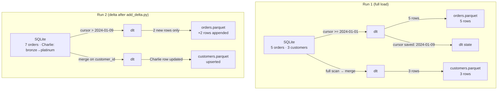

# incremental_sql_demo — `retail`

**Append and merge incremental loads from a local SQLite database — no credentials required.**

Run the pipeline twice: the second run loads **only the new and changed rows**, not the full table.

---

## Incremental Modes

| Table | Mode | Key | Behaviour |
| --- | --- | --- | --- |
| `orders` | `append` | `cursor_column: created_at` | Only rows newer than the last run are loaded |
| `customers` | `merge` | `primary_key: customer_id` | Full upsert — updates overwrite, new rows insert |



---

## Source Data

**Initial seed (`setup_db.py`):**

| order_id | customer_id | amount | created_at |
| --- | --- | --- | --- |
| 1 | 101 | 150.00 | 2024-01-05 |
| 2 | 102 | 45.50 | 2024-01-06 |
| 3 | 101 | 300.00 | 2024-01-07 |
| 4 | 103 | 80.00 | 2024-01-08 |
| 5 | 102 | 200.00 | 2024-01-09 |

**After delta (`add_delta.py`):**

| Δ | order_id | customer_id | amount | created_at |
| --- | --- | --- | --- | --- |
| ➕ new | 6 | 101 | 90.00 | 2024-02-01 |
| ➕ new | 7 | 103 | 450.00 | 2024-02-02 |

| Δ | customer_id | name | tier |
| --- | --- | --- | --- |
| ✏️ updated | 103 | Charlie | bronze → **platinum** |

---

## Run the Demo

```bash
# From examples/incremental_sql_demo/

# Step 1 — create SQLite database with seed data
python setup_db.py

# Step 2 — full bronze load (5 orders, 3 customers)
medallion run retail --layer bronze

# Step 3 — silver + gold
medallion run retail

# Inspect first-run gold output
python -c "
import polars as pl
print(pl.read_parquet('data/gold/retail/customer_summary.parquet').sort('customer_id'))
print(pl.read_parquet('data/gold/retail/pipeline_totals.parquet'))
"

# Step 4 — simulate delta: add 2 orders + promote Charlie
python add_delta.py

# Step 5 — delta bronze run (only 2 new orders + Charlie's update loaded)
medallion run retail --layer bronze
medallion run retail

# Verify: Charlie now shows 2 orders; totals updated
```

Or open `ipynb/walkthrough.ipynb` for a guided two-run comparison.

---

## Expected Output

### After Run 1 — `customer_summary.parquet`

| customer_id | total_orders | total_spent |
| --- | --- | --- |
| 101 | 2 | 450.0 |
| 102 | 2 | 245.5 |
| 103 | 1 | 80.0 |

### After Run 2 (delta) — `customer_summary.parquet`

| customer_id | total_orders | total_spent |
| --- | --- | --- |
| 101 | 3 | 540.0 |
| 102 | 2 | 245.5 |
| 103 | 2 | 530.0 |

---

## How Incremental State Is Tracked

dlt writes cursor state alongside the raw Parquet shards:

```text
data/bronze/orders/_dlt_loads/
```

Delete the shard directory to force a full reload on the next bronze run:

```bash
rm -rf data/bronze/
```

---

## Folder Structure

```text
retail/                            ← project root
├── main.yaml                      ← pipeline name, layer includes, data paths
├── README.md                      ← this file
├── kestra_flow.yaml               ← Kestra orchestration
├── ipynb/
│   └── walkthrough.ipynb          ← guided two-run comparison
├── backend/
│   ├── bronze.yaml                ← SQLite source + append/merge config
│   ├── silver.yaml                ← type casts for orders and customers
│   └── gold.yaml                  ← customer summary + grand-total aggregations
└── frontend/
    ├── tableau/                   ← Tableau workbook files
    └── powerbi/                   ← Power BI files

data/                              ← pipeline outputs (gitignored, outside project folder)
├── retail.db                      ← SQLite database (created by setup_db.py)
├── bronze/
│   ├── orders/                    ← dlt raw shards (append mode)
│   ├── customers/                 ← dlt raw shards (merge mode)
│   ├── orders.parquet             ← merged by bronze.py  ← silver reads this
│   └── customers.parquet          ← merged by bronze.py  ← silver reads this
├── silver/                        ← cast Parquet files
│   ├── orders.parquet
│   └── customers.parquet
└── gold/retail/                   ← aggregated outputs
    ├── customer_summary.parquet
    └── pipeline_totals.parquet
```

> **How paths align:** `bucket_url = "data"` in `bronze.yaml`; dlt appends `/{dataset_name}/{table}/`
> with `dataset_name = "bronze"`, so shards land at `data/bronze/{table}/`.
> `paths.bronze = "data/bronze"` in `main.yaml`; bronze.py merges shards into
> `data/bronze/{table}.parquet`, which silver reads directly.
> Delete `data/bronze/` to force a full reload on the next bronze run.

---

## Things to Try

- Add a third order in `add_delta.py` and observe that only it is picked up on next bronze run
- Change `initial_value` in `backend/bronze.yaml` and delete `_dlt_loads/` to reload from a different date
- Add a `max` metric for `amount` to `backend/gold.yaml` and re-run gold only
