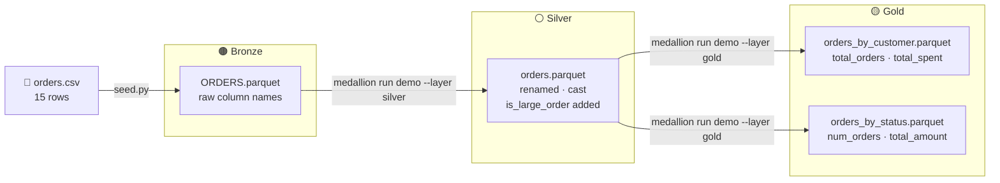

# 📂 local_parquet_demo

**Zero-credential quickstart — CSV in, gold Parquet out, no cloud account needed.**

This is the simplest possible OpenMedallion pipeline. One table, one UDF, two gold aggregations. Start here if you have never used the library before.

---

## 🔄 Pipeline Flow



---

## ⚙️ What Happens at Each Step

### Step 1 — seed.py

Reads the bundled CSV and writes a bronze Parquet file:

| Before (CSV) | After (ORDERS.parquet) |
| --- | --- |
| Raw text rows | Columnar Parquet, same column names |
| `ORDER_ID,CUSTOMER_NAME,...` | `ORDER_ID,CUSTOMER_NAME,...` |

### Step 2 — silver transform

`backend/silver.yaml` applies three transforms in order:

| Transform | What it does |
| --- | --- |
| `rename` | `ORDER_ID` → `order_id`, `CUSTOMER_ID` → `customer_id`, etc. |
| `cast` | `order_id` → `Int64`, `customer_id` → `Int64`, `amount` → `Float64` |
| `udf` | Calls `flag_large_orders()` — adds `is_large_order` boolean column |

Sample output rows from `orders.parquet`:

| order_id | customer_id | customer_name | amount | status | is_large_order |
| --- | --- | --- | --- | --- | --- |
| 1 | 101 | Alice | 250.0 | completed | true |
| 6 | 102 | Bob | 75.0 | pending | false |
| 11 | 103 | Charlie | 200.0 | completed | true |

### Step 3 — gold aggregation

Two YAML-declared aggregations run against the silver output:

**`orders_by_customer.parquet`** — group by `customer_id, customer_name`:

| customer_id | customer_name | total_orders | total_spent |
| --- | --- | --- | --- |
| 101 | Alice | 4 | 600.0 |
| 102 | Bob | 3 | 300.5 |
| 103 | Charlie | 3 | 415.0 |

**`orders_by_status.parquet`** — group by `status`:

| status | num_orders | total_amount |
| --- | --- | --- |
| completed | 11 | 2070.5 |
| pending | 3 | 230.0 |
| cancelled | 1 | 25.0 |

---

## 🚀 Run the Demo

```bash
# From this directory (examples/local_parquet_demo/)

# Step 1 — seed bronze from the bundled CSV
python seed.py

# Step 2 — silver: rename, cast, flag large orders
medallion run demo --layer silver

# Step 3 — gold: aggregate by customer and by status
medallion run demo --layer gold
```

---

## 📂 Output Files

```text
demo/data/
├── bronze/
│   └── ORDERS.parquet           # 15 rows, raw column names
├── silver/
│   └── orders.parquet           # renamed + cast + is_large_order
└── gold/
    └── demo/
        ├── orders_by_customer.parquet   # total_orders, total_spent
        └── orders_by_status.parquet     # num_orders, total_amount
```

---

## 🗂️ Project Layout

```text
demo/
├── main.yaml              # pipeline name + paths + includes
├── backend/
│   ├── bronze.yaml        # placeholder (seed.py handles bronze)
│   ├── silver.yaml        # rename, cast, udf transforms
│   ├── gold.yaml          # two group_by aggregations
│   └── udf/silver/
│       └── enrich.py      # flag_large_orders(df, threshold) → df
├── frontend/              # dashboard files
├── data/                  # gitignored pipeline outputs
├── summary/               # analysis summary
└── kestra_flow.yml        # Kestra orchestration flow — mount via docker-compose.yml
```

---

## 🔍 Read the Results

```python
import polars as pl

pl.read_parquet("demo/data/gold/demo/orders_by_customer.parquet").sort("total_spent", descending=True)
pl.read_parquet("demo/data/gold/demo/orders_by_status.parquet")
```

---

## 🔍 Things to Try

- Change the `threshold` arg in `backend/silver.yaml` (currently `100.0`) and re-run silver
- Add a `mean` metric to `backend/gold.yaml` and re-run gold
- Run `medallion dag` to print the Hamilton DAG for the full pipeline
