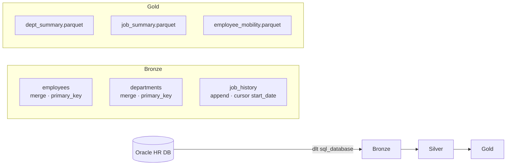

# oracle_hr_demo

Incremental Bronze → Silver → Gold pipeline against the **Oracle HR schema** using openmedallion.

## What it demos



**Run 1 — full load:** all rows loaded (no prior cursor state)  
**Run 2 — incremental:** only new hires, salary changes, and new job_history records

## Incremental modes

| Table | Mode | Why |
|-------|------|-----|
| `employees` | `merge` on `employee_id` | Salaries change, people transfer departments |
| `departments` | `merge` on `department_id` | Department structure can be reorganised |
| `job_history` | `append` cursor `start_date` | History rows are immutable — only new rows ever appear |

## Quick start

```bash
# 1. Set Oracle credentials
cp .env.example .env
# edit .env with your ORACLE_USER, ORACLE_PASS, ORACLE_HOST, ORACLE_PORT, ORACLE_SERVICE

# 2. Load env vars and run
export $(grep -v '^#' .env | xargs)

# 3. Full pipeline (bronze → silver → gold)
medallion run oracle_hr

# Or layer-by-layer
medallion run oracle_hr --layer bronze
medallion run oracle_hr --layer silver
medallion run oracle_hr --layer gold
```

Run it a second time after making changes in Oracle to see incremental behaviour.

## Dependencies

```bash
pip install oracledb python-dotenv
# or from repo root: pip install -r requirements.txt
```

## Walkthrough notebook

Open `oracle_hr/ipynb/walkthrough.ipynb` for an interactive two-run demo with inline output.
