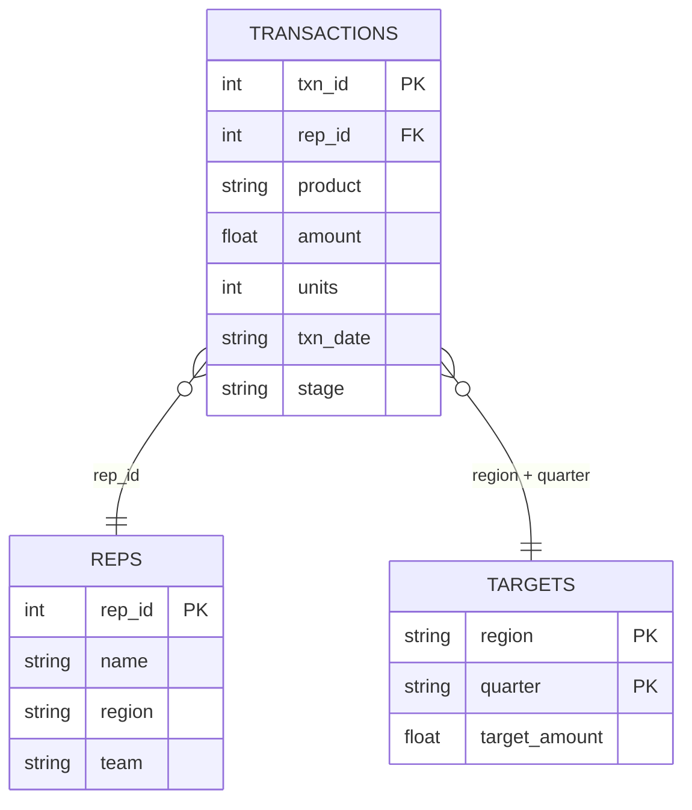
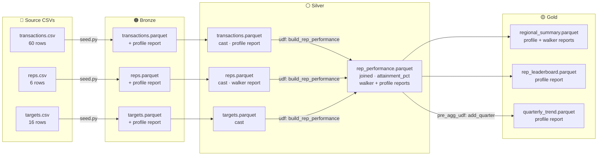

# sales_intelligence_demo

**Natural-language queries, interactive explore reports, and a full bronze → silver → gold pipeline — one self-contained example.**

This demo is the reference for all features added after 2026.5.4:

| Feature | Where |
|---|---|
| `cerebrum` — LLM → DuckDB SQL → Polars result | `show_cerebrum.py` |
| `explore: walker` (interactive pygwalker report) | `silver.yaml`, `gold.yaml` |
| Silver derived UDF (three-table join + attainment %) | `udf/silver/enrich.py` |
| Gold pre-agg UDF (pass-through / hook) | `udf/gold/metrics.py` |
| `explore: profile` on bronze, silver, gold | `bronze.yaml`, `silver.yaml`, `gold.yaml` |
| RAG accuracy add-ons — metadata, relationships, examples, confidence-gated fallback, template-routed queries | `sales_intel/metadata.yaml`, `sales_intel/relationships.yaml`, `sales_intel/examples/`, `show_rag_workflow.py` |

---

## Data Model



---

## Pipeline Flow



---

## Source Data

**reps.csv** — 6 sales reps across 2 teams and 4 regions:

| rep_id | name | region | team |
|---|---|---|---|
| 1 | Alice Chen | North | Enterprise |
| 2 | Bob Smith | South | SMB |
| 3 | Carol Lee | East | Enterprise |
| 4 | David Kim | West | SMB |
| 5 | Eve Brown | North | SMB |
| 6 | Frank Wu | East | Enterprise |

**targets.csv** — 16 rows: regional quarterly targets for Q1–Q4 2024.

**transactions.csv** — 60 closed-won deals across Q1–Q3 2024.

---

## Explore Reports

This demo uses both `profile` and `walker` report types:

| Layer | Table | Report type | What you learn |
|---|---|---|---|
| Bronze | transactions | `profile` | Data quality, null rates, distributions |
| Bronze | reps | `profile` | Team/region breakdown |
| Silver | reps | `walker` | Drag-and-drop exploration of rep attributes |
| Silver | rep_performance | `walker` | Interactive join exploration (reps × targets) |
| Silver | rep_performance | `profile` | Quality check on the derived join |
| Gold | regional_summary | `walker` | Interactive regional comparison |
| Gold | rep_leaderboard | `profile` | Top-rep distribution |

Run the pipeline with explore reports (requires `openmedallion[profile]` + `openmedallion[explore]`):

```bash
medallion run sales_intel   # no --no-explore flag
```

Reports are written to `data/<layer>/add-ons/`.

---

## cerebrum — Natural Language Queries

`show_cerebrum.py` demonstrates the cerebrum components without Ollama:

```bash
python show_cerebrum.py
```

It shows:
1. **Schema context** — the DDL string the LLM receives for all 4 silver tables
2. **Prompt preview** — how the full prompt looks with schema + few-shot examples
3. **Three live DuckDB queries** — executed directly against silver Parquet files
4. **Recommender output** — canonical question string (mock LLM)

### Sample questions you can ask with a real LLM

```
Which rep had the highest revenue in Q2?
Show me the quarterly trend for the North region
Which team — Enterprise or SMB — closed more deals?
Who is closest to hitting their quarterly target?
Compare attainment across regions in Q1 vs Q2
```

---

## RAG Accuracy Add-ons — metadata, relationships, examples, confidence-gated fallback

This project ships with curated `sales_intel/metadata.yaml`, `sales_intel/relationships.yaml`,
and `sales_intel/examples/synthetic.jsonl` — the reference artifacts for openmedallion's
full RAG accuracy pipeline (see [`docs/guides/rag-accuracy.md`](../../docs/guides/rag-accuracy.md)
for the complete design).

`show_rag_workflow.py` demonstrates all of it **without Ollama or ChromaDB installed**, by
injecting a small deterministic word-overlap embedding function in place of a real one —
the same `_embed_fn=` injection point used throughout the cerebrum test suite:

```bash
python show_rag_workflow.py
```

It shows:
1. **Curated knowledge** — the 4 approved tables in `metadata.yaml` and 3 approved
   relationships in `relationships.yaml`
2. **Dynamic few-shot retrieval** — which verified `synthetic.jsonl` examples get
   selected as few-shot context for a sample question
3. **Confidence-gated schema pruning** — one question that clears the 0.7 confidence
   threshold (structured, approved-only ranking is trusted) and one clearly off-topic
   question that doesn't (the pipeline falls back to a raw-schema search over *every*
   silver table, regardless of metadata/approval status)
4. **Template-routed queries** — `synthetic.jsonl`'s one `templated: true` example
   (a parameterized "revenue by region for a quarter" query) matched against a
   closely-worded real question, gated by the stricter 0.85 confidence threshold; the
   LLM fills only the `{quarter}` parameter, and the filled SQL still runs through the
   same validation/execution safety net as any other query
5. **The commands to go live** — regenerating/reviewing metadata, relationships, and
   examples with a real LLM, plus querying with the accuracy features engaged

### Go live with the LLM-backed commands

```bash
# Regenerate/refresh curated knowledge (Ollama by default)
medallion metadata generate      sales_intel     # draft descriptions for any new tables
medallion metadata approve       sales_intel     # human review, one table at a time
medallion metadata refresh       sales_intel     # detect schema drift, re-draft affected tables
medallion metadata refresh       sales_intel --check   # CI gate: exit 1 if schema drifted

medallion relationships generate sales_intel     # no LLM call — pure pattern matching
medallion relationships approve  sales_intel
medallion relationships erd      sales_intel     # Mermaid ER diagram → relationships_erd.md

medallion examples generate      sales_intel --count 15
medallion examples approve       sales_intel
medallion examples approve       sales_intel --template   # promote a verified example to a template

# After closing a cortex session (End Session button / 5min idle / tab close —
# a session close is what promotes rated turns, not the thumbs click itself)
medallion examples harvest sales_intel           # promote thumbs-up into synthetic.jsonl
medallion examples review  sales_intel           # list thumbs-down failures
medallion examples eval    sales_intel           # regression check: did curation help or hurt?
medallion examples eval    sales_intel --use-templates   # + compare template-routed results

# Query — metadata.yaml/examples/ are picked up automatically, no extra flag needed
medallion query sales_intel "Which rep is leading in revenue this quarter?"

# Opt-in: ambiguity detection / query decomposition / template routing (each costs
# zero-to-one extra LLM call, all off by default)
medallion query sales_intel "Show me the good ones" --detect-ambiguity
medallion query sales_intel "Headcount by team and revenue by region" --decompose
medallion query sales_intel "Revenue by region for 2024-Q2" --use-templates

# Every question is logged to sales_intel/chat_history/<user>.jsonl (audit only,
# never fed back into the LLM prompt) — --user defaults to your OS username
medallion query sales_intel "Which rep leads in revenue?" --user alice
```

Requires: `pip install "openmedallion[cerebrum]"` (bundles `chromadb`, used only as an
embedding-function provider — ranking itself is plain cosine similarity).

---

## Run the Demo

```bash
# From this directory (examples/sales_intelligence_demo/)

# Step 1 — seed bronze
python seed.py

# Step 2 — run full pipeline
medallion run sales_intel

# Step 3 — show cerebrum demo (no Ollama needed)
python show_cerebrum.py

# Step 4 — show the RAG accuracy add-ons (no Ollama/ChromaDB needed)
python show_rag_workflow.py

# Step 5 — go live with Ollama (optional)
# Terminal 1:
medallion ask sales_intel

# Terminal 2:
medallion cortex sales_intel
# → open http://localhost:8050
```

---

## Expected Results

### `regional_summary.parquet`

| region | total_revenue | num_deals |
|---|---|---|
| East | 993,000 | 20 |
| North | 744,000 | 20 |
| West | 510,000 | 10 |
| South | 449,000 | 10 |

East leads — two Enterprise reps (Carol Lee + Frank Wu) are assigned there.

### `rep_leaderboard.parquet`

| name | region | team | total_revenue | num_deals |
|---|---|---|---|---|
| Frank Wu | East | Enterprise | 534,500 | 10 |
| David Kim | West | SMB | 510,000 | 10 |
| Carol Lee | East | Enterprise | 458,500 | 10 |
| Bob Smith | South | SMB | 449,000 | 10 |
| Alice Chen | North | Enterprise | 411,000 | 10 |

### `quarterly_trend.parquet`

| quarter | quarterly_revenue | num_deals |
|---|---|---|
| 2024-Q1 | 1,007,000 | 24 |
| 2024-Q2 | 1,171,000 | 26 |
| 2024-Q3 | 518,000 | 10 |

Q2 is the peak quarter. Q3 data is partial (only July–August in the seed).

---

## Things to Try

- Add a `filter` in `bronze.yaml` to ingest only `closed_won` deals
- Extend `build_rep_performance()` to compute a rolling 3-month revenue column
- Ask cerebrum: *"Which rep has the highest attainment_pct in Q2?"*
- Add a new gold aggregation: revenue by `product` and `team`
- Switch `explore: walker` to `explore: profile` on `rep_performance` to compare report types
